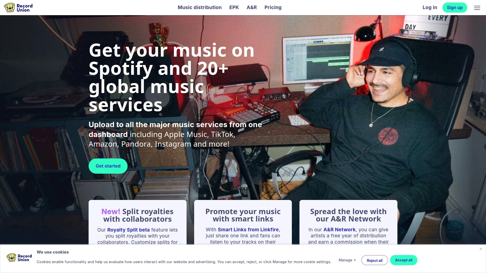
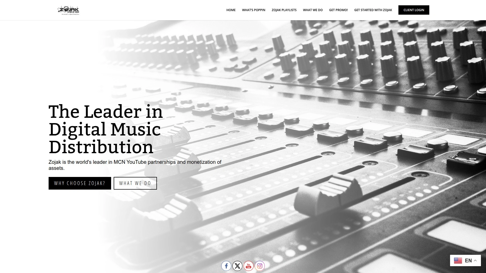

# 25 Best Digital Music Distribution Platforms in 2025

Navigating the world of digital music distribution can be a maze for independent artists. Choosing the right service is crucial for getting your tracks on Spotify, Apple Music, and other major stores without giving up your rights or a huge chunk of your revenue. This guide breaks down the top platforms to help you release music online efficiently, ensuring your sound reaches a global audience while you stay in control.

## [LANDR](https://www.landr.com)
LANDR provides an all-in-one platform for creators, integrating AI-powered mastering and a vast sample library with robust music distribution services. It’s designed as a complete ecosystem for the modern musician, from production to release.

**Key Aspects:**
* **Distribution Network**: Delivers music to over 150 digital stores and streaming services, including Spotify, Apple Music, TikTok, and Amazon Music.
* **Pricing Model**: Offers unlimited releases for a flat annual fee, starting at around $23.99, allowing artists to keep 100% of their royalties. If a subscription is canceled, LANDR keeps a 15% portion of future royalties instead of taking the music down.
* **Integrated Tools**: Beyond distribution, LANDR offers its renowned AI mastering, over 3 million royalty-free samples, collaboration tools, and curated plugins, making it a comprehensive creative suite.
* **Release Speed**: Releases can go live in as little as two business days, and the platform provides detailed analytics to track performance.

## [TuneCore](https://www.tunecore.com)
A major player in the distribution space, TuneCore allows artists to get their music into over 150 digital stores and streaming services worldwide while keeping 100% of their revenue. The service is known for its detailed sales reporting and robust features.

TuneCore offers several annual plans for unlimited releases, with different tiers unlocking more advanced features like in-depth analytics and promotional support. They also provide music publishing administration to help artists collect royalties from various sources.

## [CD Baby](https://www.cdbaby.com)
One of the oldest and most established digital distributors, CD Baby sends music to more than 150 platforms globally. It stands out by also offering physical distribution for CDs and vinyl records to over 15,000 record stores.

Unlike many competitors, CD Baby primarily uses a one-time, per-release fee structure instead of an annual subscription. The company retains a 9% portion of digital distribution revenue. It also provides services like collecting sound recording royalties and assistance with cover song licensing.

## [DistroKid](https://www.distrokid.com)
DistroKid is famous for its speed and simplicity, allowing artists to upload unlimited songs and albums for a single annual fee. The service is known for getting music into stores quickly and offers automatic revenue splits, making it easy to pay collaborators. Artists keep 100% of their earnings, and the platform includes several free tools, such as lyrics distribution and a tool to get a verified checkmark on Spotify.

## [Ditto Music](https://dittomusic.com)
Ditto Music offers unlimited distribution to hundreds of online stores for an annual subscription fee, letting artists keep 100% of their royalties. The platform is used by artists at all levels, from beginners to established acts. Ditto provides detailed trend reports, pre-save links for upcoming releases, and a chart registration tool. They also offer Vevo video distribution and sync opportunities.

## [Amuse](https://www.amuse.io)
Amuse offers a unique model with a free distribution tier that allows artists to release their music on major platforms and keep 100% of their royalties. For those needing faster releases, more stores, and additional features like team accounts and YouTube Content ID, Amuse provides paid subscription plans. The service is managed entirely through a mobile app, making it convenient for artists on the go.

## [Symphonic](https://symphonic.com)
Symphonic Distribution operates on an application basis, working with a curated roster of artists and labels. The service is known for its extensive feature set, including distribution to over 200 DSPs, detailed analytics, royalty management, and marketing support. Pricing is typically an annual fee per release, and the company retains a percentage of royalties that varies based on the plan.

## [UnitedMasters](https://www.unitedmasters.com)
Positioning itself as an alternative to traditional record labels, UnitedMasters provides distribution services alongside tools to help artists connect with brands and fans. It offers plans that allow artists to keep 100% of their earnings for an annual fee, as well as a free option where the company retains 10% of the revenue. The platform gives artists access to a suite of promotional tools and a customized artist website.

## [AWAL](https://www.awal.com)
AWAL, which stands for Artists Without A Label, is a selective distribution service that does not charge upfront fees. Instead, it operates on a model where it retains a 15% portion of the revenue generated. The platform focuses on providing personalized support for its curated roster of artists, offering advanced analytics, sync licensing opportunities, and marketing assistance to help develop their careers.

## [ONErpm](https://www.onerpm.com)
ONErpm functions as both a DIY distribution service and a full-service label, offering a tiered approach to its services. Anyone can use their basic distribution for free, with the company retaining a percentage of the revenue (typically 15% for audio). For artists who gain traction, ONErpm offers additional label services like marketing and promotion in exchange for a higher percentage. They are also known for their advanced YouTube monetization services.

## [Soundrop](https://www.soundrop.com)
Soundrop offers a straightforward distribution model with no upfront or annual fees. The service charges a small fee for cover song licensing and retains a 15% share of the revenue generated from your music. It is particularly known for its simple fee structure and easy-to-use revenue splitting tool, making it a solid option for collaborators and artists who release cover songs frequently.

## [Record Union](https://www.recordunion.com)
Based in Sweden, Record Union allows artists to distribute their music for a per-release fee. The platform offers several distribution packages depending on the number of stores you want to reach. The company retains a percentage of artist royalties, which varies depending on the plan selected.

## [MusicAlligator](https://musicalligator.com)
MusicAlligator delivers music to over 80 digital service providers and supports monetization on platforms like Beatport and SoundCloud. The service uses a pay-per-release model and ensures artists receive a transparent payment of 80% or more, depending on turnover. It also provides fast delivery, daily stats, and tools for playlist pitching and lyrics distribution.

## [Too Lost](https://toolost.com)
Too Lost provides music distribution, publishing, and rights management services for independent artists and labels. The platform offers unlimited distribution for an annual subscription fee, allowing artists to keep 100% of their streaming revenue. It also includes tools for creating smart links, customizing label branding, and managing YouTube Content ID.

## [Unchained Music](https://www.unchainedmusic.io)
Unchained Music offers free music distribution to all major platforms, allowing artists to keep 100% of their royalties. The service is built on a "pay-what-you-want" model, where artists can optionally contribute to support the platform. It focuses on simplicity and transparency, making it an accessible option for emerging artists.

## [Horus Music](https://www.horusmusic.global)
This UK-based company offers both unlimited distribution packages for an annual fee and single-release options. Artists keep 100% of their royalties with the unlimited plans. Horus Music is known for its direct-to-artist support and offers additional services like marketing campaigns and playlist pitching.

## [Cygnus Music](https://www.cygnusmusic.net)
Cygnus Music is a distribution service that caters heavily to electronic music labels and artists, though it supports all genres. They offer a flexible pricing structure, typically based on a percentage of sales, and provide label management tools, promotional services, and direct delivery to specialized stores like Beatport and Juno Download.

## [iMusician](https://www.imusician.pro)
iMusician offers a flexible distribution model with no annual fees. Artists can choose from various plans and only pay a one-time fee per release. The plans range from a starter option where the company keeps a 30% cut to pro plans with a 0% cut. The service distributes to a wide range of stores, including niche and regional platforms.

## [RouteNote](https://www.routenote.com)
RouteNote offers two main distribution models. The free model allows artists to upload their music at no cost, and RouteNote retains 15% of the earnings. Alternatively, the Premium model lets artists pay an upfront fee and keep 100% of their royalties. This flexibility makes it suitable for artists with different budgets and release strategies.

## [FreshTunes](https://freshtunes.com)
FreshTunes is a completely free music distribution service that allows artists to get their music on all major streaming platforms without any fees or a percentage cut. The platform makes its money through additional services and professional feedback options that artists can choose to purchase.

## [Repost by SoundCloud](https://artists.soundcloud.com/repost)
Repost by SoundCloud is a distribution service integrated directly within the SoundCloud platform. For an annual fee, artists can distribute unlimited music to major streaming services like Spotify and Apple Music while keeping a majority of their revenue. It also offers promotional tools, professional marketing services, and the ability to monetize plays on SoundCloud itself.

## [Level Music](https://www.levelmusic.com)
Created by the team behind the music rights organization BMI, Level offers distribution services for an annual fee. The platform provides unlimited uploads and lets artists keep 100% of their rights and royalties. It features a clean interface, release analytics, and is designed to be a straightforward tool for independent creators.

## [Stem](https://stem.is)
Stem is a distribution platform that focuses on simplifying royalty splits for collaborative projects. The service is selective and operates on an invite-only basis. Once accepted, artists can distribute music and easily set up automated percentage allocations for all collaborators on a track, ensuring everyone gets paid correctly and on time. Stem retains a percentage of the revenue.

## [Zojak World Wide](https://www.zojakworldwide.com)
Specializing in reggae and dancehall music but open to all genres, Zojak World Wide offers digital distribution to a global network of online retailers. The service is known for its strong presence in the Caribbean music scene and provides marketing and promotional services tailored to its artists.

## [OFFstep](https://offstep.com)
OFFstep is a music distributor that offers free payment splitting within its plans. A notable feature is that collaborators do not need a paid account to receive royalties from releases they are featured on, which simplifies the process for artists working with multiple contributors.

## FAQ
**How quickly can my music get into stores?**
It varies by distributor, but most platforms can get your release live in a few days to two weeks. Services like LANDR and DistroKid are known for particularly fast turnaround times, sometimes in just 1–2 days.

**Do I keep the rights to my music?**
Yes, with all the reputable distributors listed, you retain 100% of your ownership rights and master recordings. These services act as a pipeline to digital stores, not as a traditional label that takes ownership.

**What's the difference between an annual fee and a per-release model?**
An annual fee allows for unlimited releases for a flat yearly cost, which is ideal for prolific artists. A per-release model, like CD Baby's, charges for each single or album you distribute, which can be more cost-effective for those who release music infrequently.

## Conclusion
Choosing the right digital music distribution service is a foundational step in your independent music career. By evaluating factors like pricing, store network, and additional features, you can find a platform that aligns perfectly with your goals. For artists seeking an integrated solution that combines powerful production tools with straightforward distribution, **[LANDR](https://www.landr.com)** stands out as an excellent choice for managing the entire creative process, from the initial idea to the final release.
